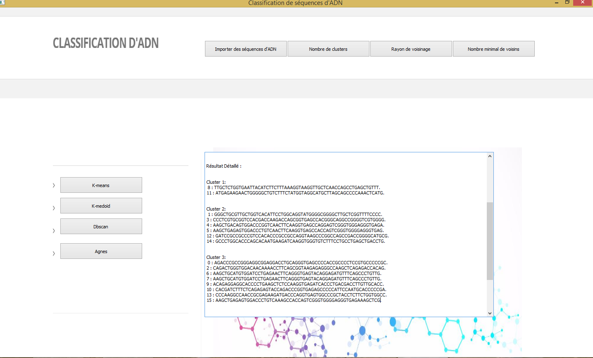

# DNA-sequences-clustering
Une application pour le partitionnement de séquences d'ADN. Elle vise à diviser l'ensemble de séquences en différents groupes homogènes en sorte que les données de chaque sous-ensemble partagent des caractéristiques communes, en tremes de distances entre elles.
##  



## Technologies
* Python
* PyQt5

## Fonctionnalités 
* Lecture et traitement d’un fichier Fasta (séparation entre clé et séquence).
* Calcul de similarités entre les séquences selon la distance de Levenshtein.
* Calcul de la chaine centrale d’une classe.
* Classification non supervisée des séquences selon les méthodes de clustering :
  - K-Means
  - K-Medoïd
  - DBSCAN (Density-based spatial clustering of applications with noise)
  - Agnes
## Modules
* PyQt5
* matplotlib
* pandas
* numpy
* time 
* sys
* random
## Installation
```
pip install PyQt5
pip install matplotlib
pip install pandas
pip install numpy
pip install time 
pip install sys
pip install random

```
```
git clone https://github.com/sirineFoudili/DNA-sequences-clustering.git
```
